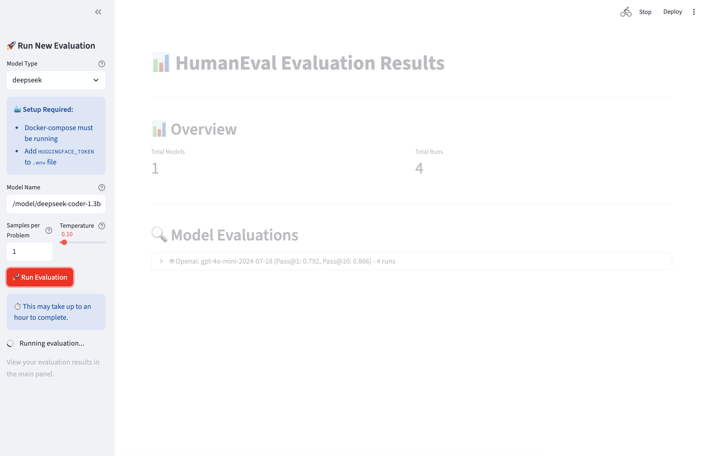

# Code Evaluator Benchmark

A simple code evaluation benchmark built around **HumanEval** - a collection of 164 hand-written programming problems for testing code generation models.

## What is HumanEval?

HumanEval is a standard benchmark with 164 programming problems that test how well AI models can:
- Understand problem requirements
- Generate correct Python code
- Pass comprehensive test suites

## Evaluation Metrics

### Pass@1
**Pass@1** measures the percentage of problems that are solved correctly on the **first attempt**. This metric evaluates the model's ability to generate correct code without multiple tries.

- **Formula**: `(Number of problems solved correctly on first try) / (Total number of problems)`
- **Range**: 0.0 to 1.0 (0% to 100%)
- **Interpretation**: Higher values indicate better code generation quality

### Pass@10
**Pass@10** measures the percentage of problems that are solved correctly within **10 attempts**. This metric evaluates the model's ability to generate correct code when given multiple chances.

- **Formula**: `(Number of problems solved correctly within 10 tries) / (Total number of problems)`
- **Range**: 0.0 to 1.0 (0% to 100%)
- **Interpretation**: Higher values indicate better problem-solving capability with multiple attempts

### Example Problem

Here's an example from the HumanEval dataset:

```python
def has_close_elements(numbers: List[float], threshold: float) -> bool:
    """ Check if in given list of numbers, are any two numbers closer to each other than
    given threshold.
    >>> has_close_elements([1.0, 2.0, 3.0], 0.5)
    False
    >>> has_close_elements([1.0, 2.8, 3.0, 4.0, 5.0, 2.0], 0.3)
    True
    """
    # Model needs to generate the implementation here
```

**Test Cases:**
```python
def check(candidate):
    assert candidate([1.0, 2.0, 3.9, 4.0, 5.0, 2.2], 0.3) == True
    assert candidate([1.0, 2.0, 3.9, 4.0, 5.0, 2.2], 0.05) == False
    assert candidate([1.0, 2.0, 5.9, 4.0, 5.0], 0.95) == True
    # ... more test cases
```

## Setup

1. **Install the benchmark:**
```bash
cd benchmark
pip install -e .
```

2. **Install dependencies:**
```bash
pip install -r requirements.txt
```

3. **Set up environment variables:**
Create a `.env` file:
```bash
OPENAI_API_KEY=your_openai_api_key_here
HF_TOKEN=your_huggingface_token_here
```

## Usage

### 1. Start Local Models (Optional)

**Mistral:**
```bash
docker-compose -f models/docker-compose-mistral.yaml up
```

**DeepSeek:**
```bash
docker-compose -f models/docker-compose-deepseek.yaml up
```

### 2. Run Evaluations

**Command line:**
```bash
python evals.py
```

**Streamlit interface:**
```bash
streamlit run streamlit.py
```

The Streamlit interface provides an easy way to:
- Select models (OpenAI, Mistral, DeepSeek)
- Configure parameters
- Run evaluations
- View results



*The Streamlit interface showing model selection, parameter configuration, and evaluation results*

## Results

Results are saved in the `results/` directory and can be viewed through the Streamlit interface.

**Example results:**
- Pass@1: 45.1% (problems solved on first try)
- Pass@10: 63.4% (problems solved within 10 tries)